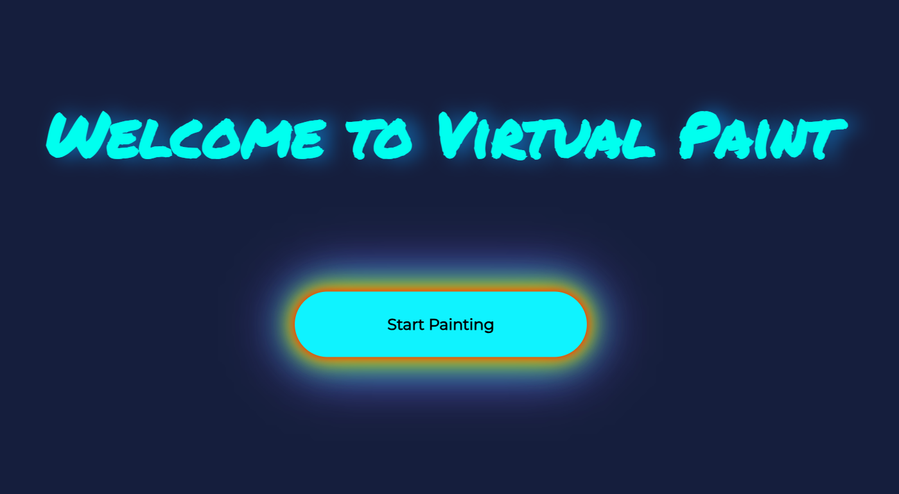
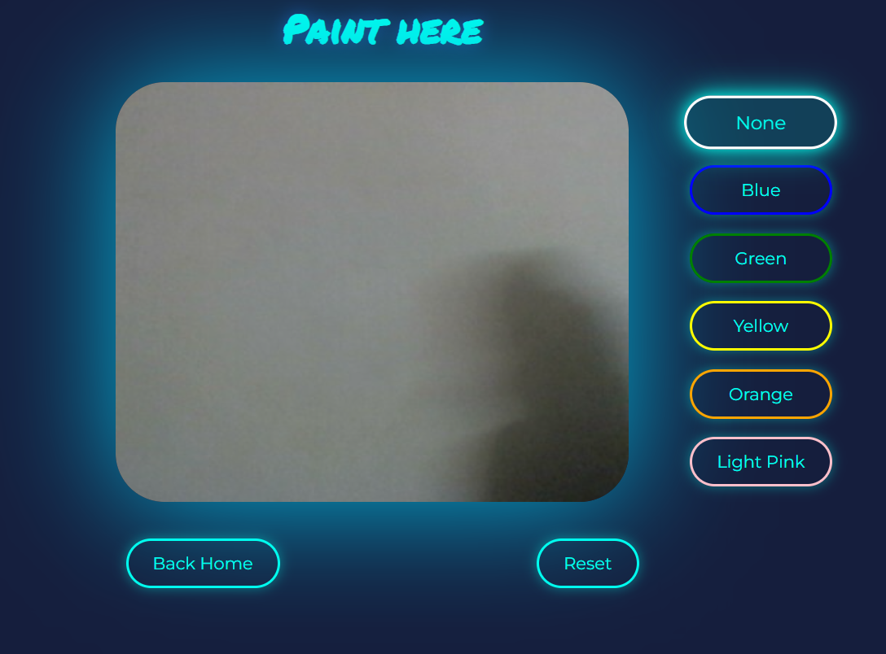
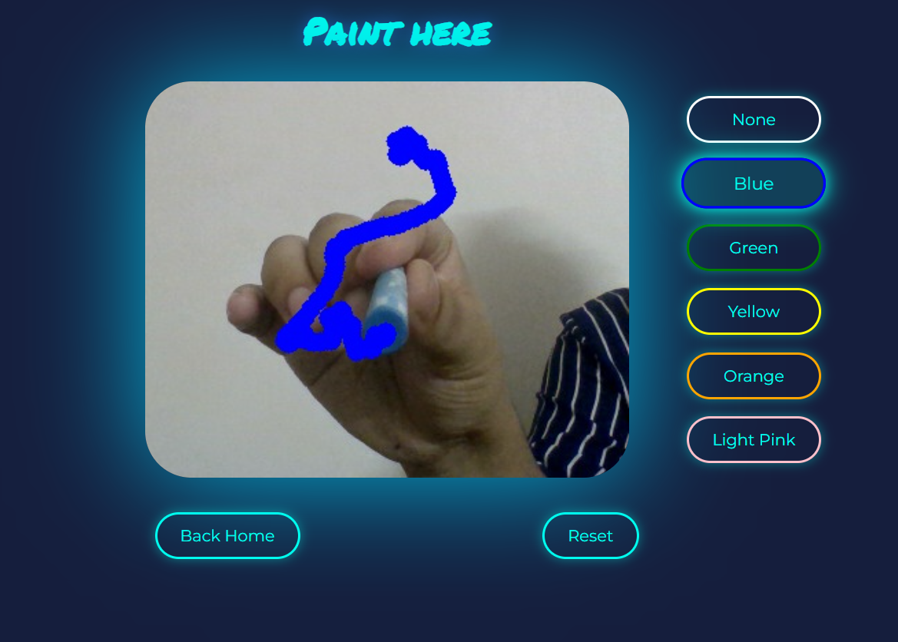
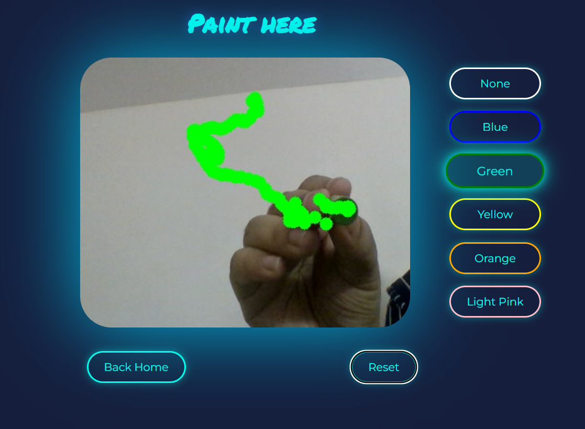
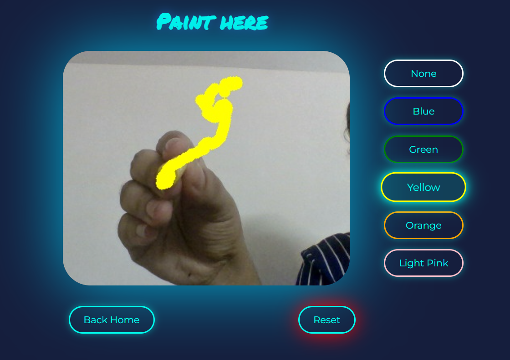
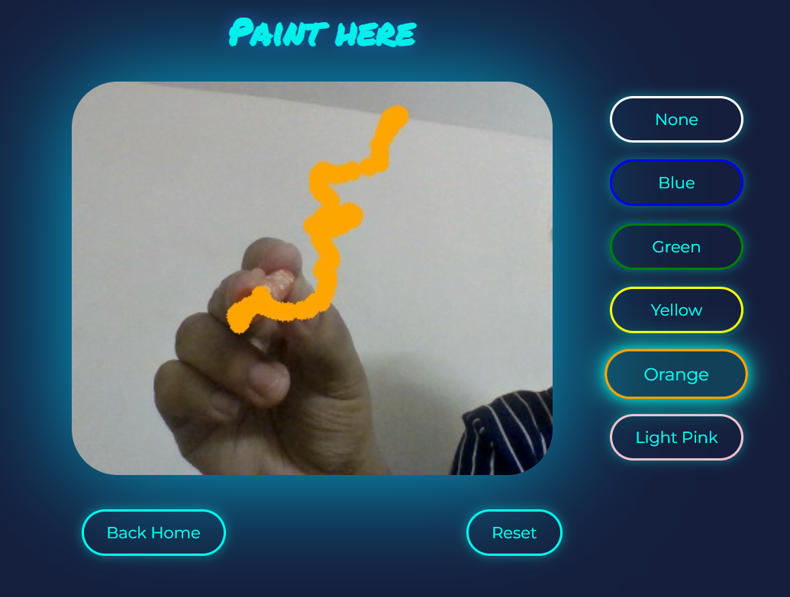
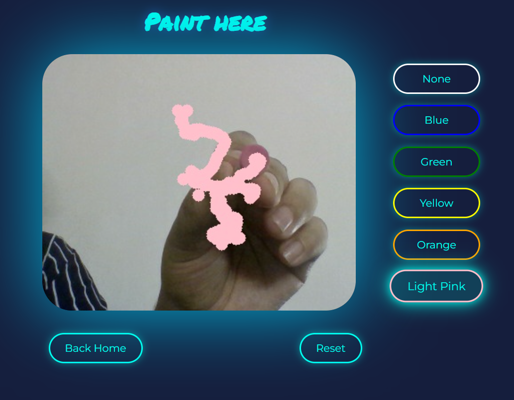
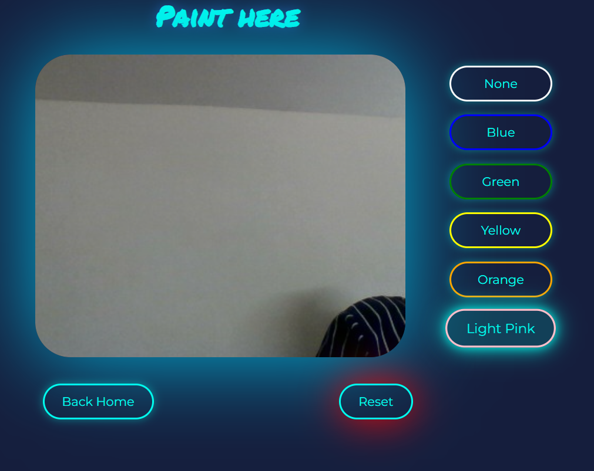
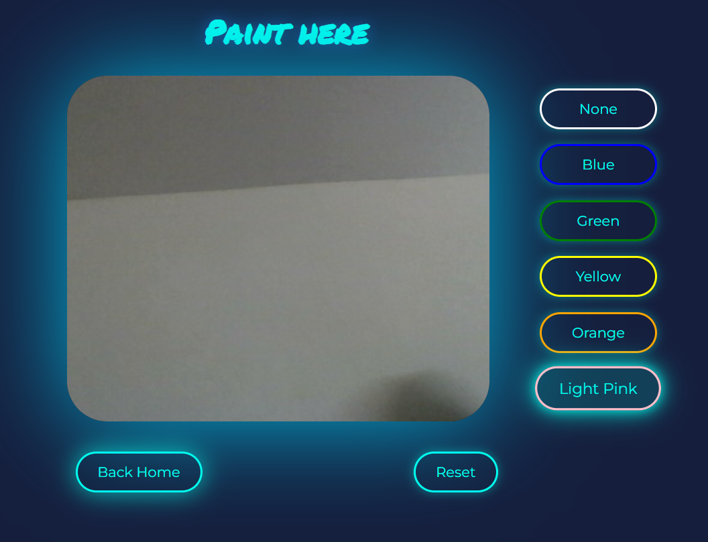

# 🎨 Virtual Paint Application

A computer vision–based virtual painting application that allows users to draw on a virtual canvas using real-time color tracking via a webcam.

Built with **OpenCV** for vision processing and **Flask** for streaming the video feed to a web interface.

---

## 🚀 Features
- Real-time color-based object tracking
- Draw virtually using colored markers or objects
- Multiple color selection with active state
- Reset canvas functionality
- Clean, animated web UI
- Live video stream using Flask

---

## 🛠️ Tech Stack
- Python
- OpenCV
- Flask
- HTML
- CSS
- JavaScript

---

## 📸 Screenshots

### Home Page


### Paint Interface


### Color Drawing Example






### Reset and Back Home buttons



---

## 🎥 Demo Video
[Click here to watch demo](static/assets/demo.mp4)

---

## ⚙️ How to Run Locally

1. Clone the repository
```bash
git clone https://github.com/garima-shalvi/virtual-paint.git
cd virtual-paint
```
2. Install dependencies
```bash
pip install opencv-python flask numpy
```
3. Run the application
```bash
python app.py
```
4. Open your browser and visit: 
```
http://127.0.0.1:5000/home
```

